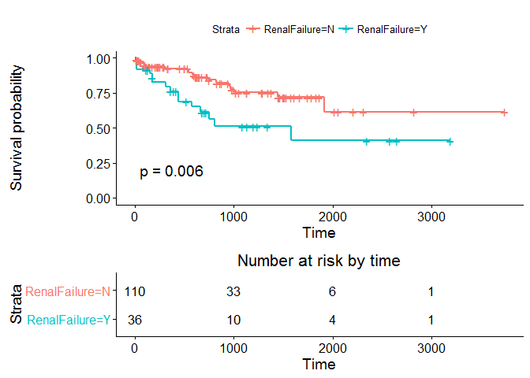
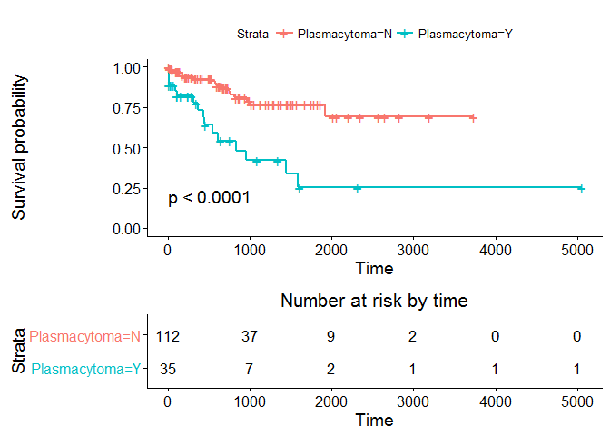
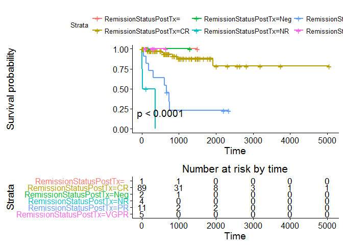
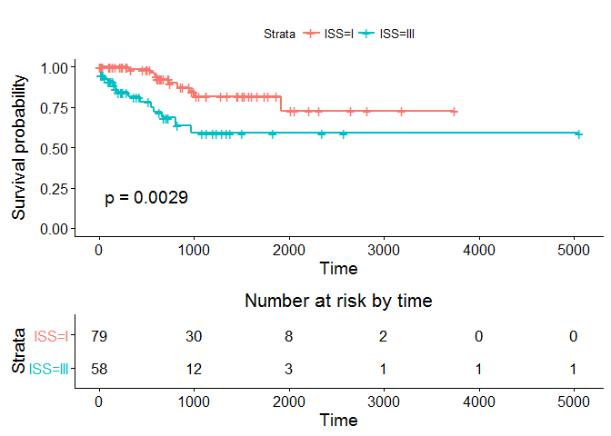
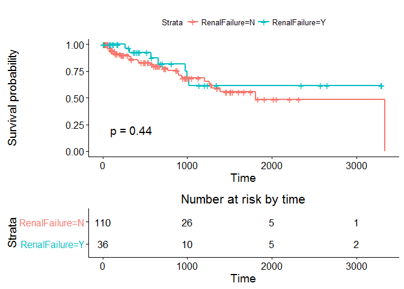
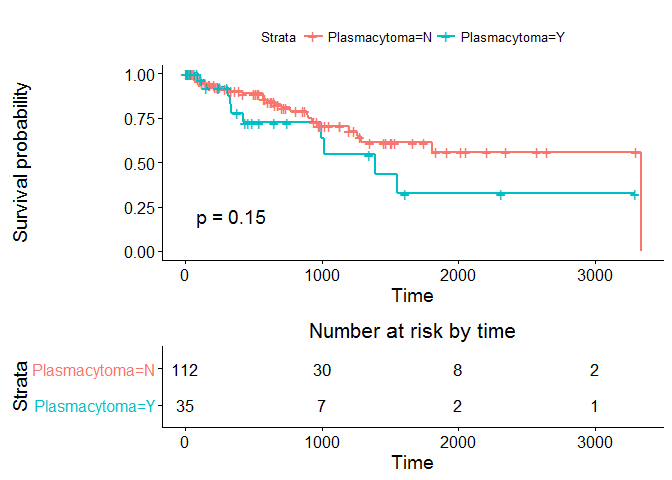
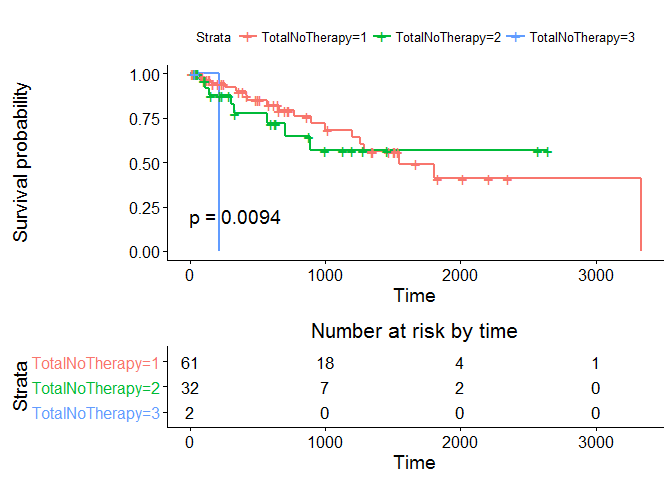
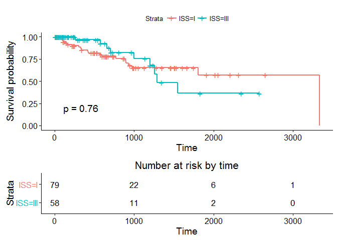

This analysis is with the latest data received today (29 Sep 16).

Analysis on Death Date
----------------------

### Overall

``` r
library(dplyr)
library(ggplot2)
library(survival)
library(lubridate)
library(tidyr)
library(broom)
library(survminer)

#Read in the data
BMT <- read.csv("BMT_29Sep.csv",na.strings=c("", "NA"))

#Select variables of interest
BMT1 <- select(BMT, TypeOfMM, Transplant.Date, C.Status,Death.date, Last.Follow.up,M.protein..,RenalFailure,Plasmacytoma,RelapseDate,ISS,TotalNoTherapy,RemissionStatusPreTx,RemissionStatusPostTx)
BMT1$Transplant.Date <- dmy(BMT1$Transplant.Date)
BMT1$Last.Follow.up <- dmy(BMT1$Last.Follow.up)
BMT1$Death.date <- dmy(BMT1$Death.date)
BMT1$RelapseDate <- dmy(BMT1$RelapseDate)

#Create censoring indicator variable for death
cenin_dead <- rep(1, nrow(BMT1))
for (i in 1:nrow(BMT1)) ifelse(BMT1$C.Status[i]!='Dead',cenin_dead[i] <- 0,cenin_dead[i] <- 1)

#Replace 'NA' death dates with LFU dates
index <- which(is.na(BMT1$Death.date))
BMT1$Death.date[index] <- BMT1$Last.Follow.up[index]

#Find time difference
BMT1 <- mutate(BMT1, TD=as.numeric(Death.date-Transplant.Date))
surv_data <- cbind(BMT1,cenin_dead)
```

Now let's plot the KM survival distribution for overall death.

``` r
fit_overall <- survfit(Surv(surv_data$TD,surv_data$cenin_dead)~1,conf.type = "log-log")
ggsurvplot(fit_overall,risk.table = T, risk.table.height = 0.4,pval = T)
```


We can have a look at the model.

``` r
summary(fit_overall)
```

    ## Call: survfit(formula = Surv(surv_data$TD, surv_data$cenin_dead) ~ 
    ##     1, conf.type = "log-log")
    ## 
    ## 58 observations deleted due to missingness 
    ##  time n.risk n.event survival std.err lower 95% CI upper 95% CI
    ##     9    148       1    0.993 0.00673        0.953        0.999
    ##    11    147       1    0.986 0.00949        0.947        0.997
    ##    15    146       1    0.980 0.01158        0.938        0.993
    ##    16    144       1    0.973 0.01335        0.929        0.990
    ##    21    142       1    0.966 0.01491        0.920        0.986
    ##    48    130       1    0.959 0.01655        0.910        0.981
    ##    89    127       1    0.951 0.01806        0.900        0.976
    ##    92    126       1    0.944 0.01943        0.890        0.971
    ##   112    123       1    0.936 0.02073        0.880        0.966
    ##   154    114       1    0.928 0.02211        0.869        0.961
    ##   174    112       1    0.919 0.02341        0.859        0.955
    ##   181    108       1    0.911 0.02470        0.848        0.949
    ##   309     95       1    0.901 0.02623        0.835        0.942
    ##   311     94       1    0.892 0.02765        0.823        0.935
    ##   365     89       1    0.882 0.02910        0.810        0.927
    ##   438     85       1    0.871 0.03055        0.797        0.920
    ##   439     84       1    0.861 0.03190        0.784        0.912
    ##   540     78       1    0.850 0.03334        0.770        0.904
    ##   545     77       1    0.839 0.03469        0.757        0.895
    ##   580     76       1    0.828 0.03595        0.743        0.887
    ##   585     75       1    0.817 0.03712        0.730        0.878
    ##   614     73       1    0.806 0.03826        0.717        0.869
    ##   663     65       1    0.793 0.03963        0.702        0.859
    ##   740     56       1    0.779 0.04138        0.685        0.848
    ##   750     54       1    0.765 0.04305        0.667        0.837
    ##   811     53       1    0.750 0.04459        0.650        0.826
    ##   827     52       1    0.736 0.04601        0.633        0.814
    ##   949     47       1    0.720 0.04762        0.614        0.801
    ##   969     46       1    0.704 0.04909        0.596        0.789
    ##  1004     43       1    0.688 0.05061        0.577        0.775
    ##  1447     29       1    0.664 0.05414        0.546        0.758
    ##  1584     19       1    0.629 0.06155        0.496        0.736
    ##  1917     12       1    0.577 0.07553        0.416        0.708

``` r
print(fit_overall)
```

    ## Call: survfit(formula = Surv(surv_data$TD, surv_data$cenin_dead) ~ 
    ##     1, conf.type = "log-log")
    ## 
    ##    58 observations deleted due to missingness 
    ##       n  events  median 0.95LCL 0.95UCL 
    ##     148      33      NA    1584      NA

### Renal Failure

``` r
RF <- na.omit(select(surv_data, RenalFailure, TD, cenin_dead))
fit_RF <- survfit(Surv(TD,cenin_dead)~RenalFailure,data=RF)
ggsurvplot(fit_RF,risk.table = T,risk.table.height = 0.4,pval = T)
```



``` r
summary(fit_RF)
```

    ## Call: survfit(formula = Surv(TD, cenin_dead) ~ RenalFailure, data = RF)
    ## 
    ##                 RenalFailure=N 
    ##  time n.risk n.event survival std.err lower 95% CI upper 95% CI
    ##    11    110       1    0.991 0.00905        0.973        1.000
    ##    21    107       1    0.982 0.01286        0.957        1.000
    ##    48     95       1    0.971 0.01636        0.940        1.000
    ##    89     92       1    0.961 0.01929        0.924        0.999
    ##    92     91       1    0.950 0.02177        0.908        0.994
    ##   112     88       1    0.939 0.02406        0.893        0.988
    ##   309     67       1    0.925 0.02748        0.873        0.981
    ##   540     59       1    0.910 0.03117        0.851        0.973
    ##   545     58       1    0.894 0.03435        0.829        0.964
    ##   585     57       1    0.878 0.03716        0.808        0.954
    ##   614     55       1    0.862 0.03977        0.788        0.944
    ##   740     43       1    0.842 0.04361        0.761        0.932
    ##   827     41       1    0.822 0.04713        0.734        0.920
    ##   949     36       1    0.799 0.05105        0.705        0.906
    ##   969     35       1    0.776 0.05446        0.676        0.891
    ##  1004     32       1    0.752 0.05791        0.647        0.874
    ##  1447     23       1    0.719 0.06395        0.604        0.856
    ##  1917      7       1    0.616 0.10978        0.435        0.874
    ## 
    ##                 RenalFailure=Y 
    ##  time n.risk n.event survival std.err lower 95% CI upper 95% CI
    ##     9     36       1    0.972  0.0274        0.920        1.000
    ##    15     35       1    0.944  0.0382        0.873        1.000
    ##    16     34       1    0.917  0.0461        0.831        1.000
    ##   154     31       1    0.887  0.0532        0.789        0.998
    ##   174     30       1    0.858  0.0591        0.749        0.982
    ##   181     27       1    0.826  0.0649        0.708        0.963
    ##   311     26       1    0.794  0.0697        0.668        0.943
    ##   365     25       1    0.762  0.0738        0.630        0.922
    ##   438     21       1    0.726  0.0787        0.587        0.898
    ##   439     20       1    0.690  0.0827        0.545        0.872
    ##   580     18       1    0.651  0.0866        0.502        0.845
    ##   663     17       1    0.613  0.0895        0.460        0.816
    ##   750     12       1    0.562  0.0955        0.403        0.784
    ##   811     11       1    0.511  0.0996        0.349        0.749
    ##  1584      5       1    0.409  0.1212        0.228        0.731

``` r
print(fit_RF)
```

    ## Call: survfit(formula = Surv(TD, cenin_dead) ~ RenalFailure, data = RF)
    ## 
    ##                  n events median 0.95LCL 0.95UCL
    ## RenalFailure=N 110     18     NA    1917      NA
    ## RenalFailure=Y  36     15   1584     663      NA

### Plasmacytoma

``` r
PC <- na.omit(select(surv_data, Plasmacytoma, TD, cenin_dead))
fit_PC <- survfit(Surv(TD,cenin_dead)~Plasmacytoma,data=PC)
ggsurvplot(fit_PC,risk.table = T, risk.table.height = 0.4,pval = T)
```



``` r
summary(fit_PC)
```

    ## Call: survfit(formula = Surv(TD, cenin_dead) ~ Plasmacytoma, data = PC)
    ## 
    ##                 Plasmacytoma=N 
    ##  time n.risk n.event survival std.err lower 95% CI upper 95% CI
    ##    21    111       1    0.991 0.00897        0.974        1.000
    ##    48    101       1    0.981 0.01320        0.956        1.000
    ##    92     99       1    0.971 0.01637        0.940        1.000
    ##   154     90       1    0.960 0.01942        0.923        0.999
    ##   174     89       1    0.950 0.02200        0.908        0.994
    ##   181     85       1    0.939 0.02441        0.892        0.988
    ##   309     75       1    0.926 0.02710        0.874        0.981
    ##   545     65       1    0.912 0.03020        0.854        0.973
    ##   580     64       1    0.898 0.03292        0.835        0.964
    ##   585     63       1    0.883 0.03534        0.817        0.955
    ##   663     55       1    0.867 0.03818        0.796        0.945
    ##   740     46       1    0.848 0.04174        0.770        0.934
    ##   750     45       1    0.829 0.04487        0.746        0.922
    ##   811     44       1    0.811 0.04765        0.722        0.910
    ##   969     39       1    0.790 0.05076        0.696        0.896
    ##  1004     36       1    0.768 0.05388        0.669        0.881
    ##  1917     10       1    0.691 0.08751        0.539        0.886
    ## 
    ##                 Plasmacytoma=Y 
    ##  time n.risk n.event survival std.err lower 95% CI upper 95% CI
    ##     9     35       1    0.971  0.0282        0.918        1.000
    ##    11     34       1    0.943  0.0392        0.869        1.000
    ##    15     33       1    0.914  0.0473        0.826        1.000
    ##    16     32       1    0.886  0.0538        0.786        0.998
    ##    89     27       1    0.853  0.0610        0.741        0.981
    ##   112     26       1    0.820  0.0669        0.699        0.962
    ##   311     19       1    0.777  0.0760        0.641        0.941
    ##   365     17       1    0.731  0.0842        0.584        0.916
    ##   438     16       1    0.686  0.0905        0.529        0.888
    ##   439     15       1    0.640  0.0953        0.478        0.857
    ##   540     13       1    0.591  0.0999        0.424        0.823
    ##   614     12       1    0.541  0.1030        0.373        0.786
    ##   827      9       1    0.481  0.1077        0.310        0.746
    ##   949      8       1    0.421  0.1097        0.253        0.702
    ##  1447      5       1    0.337  0.1157        0.172        0.660
    ##  1584      4       1    0.253  0.1133        0.105        0.609

``` r
print(fit_PC)
```

    ## Call: survfit(formula = Surv(TD, cenin_dead) ~ Plasmacytoma, data = PC)
    ## 
    ##                  n events median 0.95LCL 0.95UCL
    ## Plasmacytoma=N 112     17     NA      NA      NA
    ## Plasmacytoma=Y  35     16    827     439      NA

### Remission Status Before

``` r
RSPre <- na.omit(select(surv_data, RemissionStatusPreTx, TD, cenin_dead))
fit_RSPre <- survfit(Surv(TD,cenin_dead)~RemissionStatusPreTx,data=RSPre)
ggsurvplot(fit_RSPre,risk.table = T,risk.table.height = 0.4,pval = T)
```


``` r
summary(fit_RSPre)
```

    ## Call: survfit(formula = Surv(TD, cenin_dead) ~ RemissionStatusPreTx, 
    ##     data = RSPre)
    ## 
    ##                 RemissionStatusPreTx=CR 
    ##  time n.risk n.event survival std.err lower 95% CI upper 95% CI
    ##   438     15       1    0.933  0.0644        0.815        1.000
    ##   580     14       1    0.867  0.0878        0.711        1.000
    ##   585     13       1    0.800  0.1033        0.621        1.000
    ##   614     12       1    0.733  0.1142        0.540        0.995
    ##   827      9       1    0.652  0.1273        0.445        0.956
    ##   969      7       1    0.559  0.1391        0.343        0.910
    ##  1004      6       1    0.466  0.1437        0.254        0.853
    ##  1584      3       1    0.310  0.1589        0.114        0.846
    ## 
    ##                 RemissionStatusPreTx=NR 
    ##  time n.risk n.event survival std.err lower 95% CI upper 95% CI
    ##    11      7       1    0.857   0.132       0.6334            1
    ##    15      6       1    0.714   0.171       0.4471            1
    ##   174      4       1    0.536   0.201       0.2570            1
    ##   309      3       1    0.357   0.198       0.1205            1
    ##   311      2       1    0.179   0.160       0.0307            1
    ##   365      1       1    0.000     NaN           NA           NA
    ## 
    ##                 RemissionStatusPreTx=PR 
    ##  time n.risk n.event survival std.err lower 95% CI upper 95% CI
    ##    48     18       1    0.944  0.0540       0.8443        1.000
    ##    89     17       1    0.889  0.0741       0.7549        1.000
    ##   112     16       1    0.833  0.0878       0.6778        1.000
    ##   154     12       1    0.764  0.1044       0.5843        0.999
    ##   181     10       1    0.688  0.1187       0.4902        0.964
    ##   439      8       1    0.602  0.1313       0.3922        0.923
    ##   663      6       1    0.501  0.1427       0.2870        0.876
    ##   740      4       1    0.376  0.1524       0.1699        0.832
    ##   750      3       1    0.251  0.1442       0.0812        0.774
    ##   811      2       1    0.125  0.1142       0.0210        0.748
    ## 
    ##                 RemissionStatusPreTx=VGPR 
    ##  time n.risk n.event survival std.err lower 95% CI upper 95% CI
    ##   545      4       1    0.750   0.217       0.4259            1
    ##   949      2       1    0.375   0.286       0.0839            1

``` r
print(fit_RSPre)
```

    ## Call: survfit(formula = Surv(TD, cenin_dead) ~ RemissionStatusPreTx, 
    ##     data = RSPre)
    ## 
    ##                            n events median 0.95LCL 0.95UCL
    ## RemissionStatusPreTx=CR   25      8   1004     827      NA
    ## RemissionStatusPreTx=NR    7      6    309      15      NA
    ## RemissionStatusPreTx=PR   20     10    740     181      NA
    ## RemissionStatusPreTx=VGPR 16      2    949     545      NA

### Remission Status After

``` r
RSPost <- na.omit(select(surv_data, RemissionStatusPostTx, TD, cenin_dead))
fit_RSPost <- survfit(Surv(TD,cenin_dead)~RemissionStatusPostTx,data=RSPost)
ggsurvplot(fit_RSPost,risk.table = T, risk.table.height = 0.4,pval = T)
```



``` r
summary(fit_RSPost)
```

    ## Call: survfit(formula = Surv(TD, cenin_dead) ~ RemissionStatusPostTx, 
    ##     data = RSPost)
    ## 
    ##                 RemissionStatusPostTx=   
    ##      time n.risk n.event survival std.err lower 95% CI upper 95% CI
    ## 
    ##                 RemissionStatusPostTx=CR 
    ##  time n.risk n.event survival std.err lower 95% CI upper 95% CI
    ##   154     73       1    0.986  0.0136        0.960        1.000
    ##   174     71       1    0.972  0.0192        0.935        1.000
    ##   545     51       1    0.953  0.0267        0.902        1.000
    ##   585     50       1    0.934  0.0323        0.873        1.000
    ##   827     37       1    0.909  0.0401        0.834        0.991
    ##   949     32       1    0.881  0.0478        0.792        0.980
    ##  1917      9       1    0.783  0.1016        0.607        1.000
    ## 
    ##                 RemissionStatusPostTx=Neg 
    ##      time n.risk n.event survival std.err lower 95% CI upper 95% CI
    ## 
    ##                 RemissionStatusPostTx=NR 
    ##  time n.risk n.event survival std.err lower 95% CI upper 95% CI
    ##    11      4       1     0.75   0.217        0.426            1
    ##    15      3       1     0.50   0.250        0.188            1
    ##   365      1       1     0.00     NaN           NA           NA
    ## 
    ##                 RemissionStatusPostTx=PR 
    ##  time n.risk n.event survival std.err lower 95% CI upper 95% CI
    ##    48     11       1    0.909  0.0867       0.7541        1.000
    ##   112     10       1    0.818  0.1163       0.6192        1.000
    ##   181      9       1    0.727  0.1343       0.5064        1.000
    ##   311      8       1    0.636  0.1450       0.4071        0.995
    ##   614      7       1    0.545  0.1501       0.3180        0.936
    ##   663      6       1    0.455  0.1501       0.2379        0.868
    ##   740      4       1    0.341  0.1495       0.1443        0.805
    ##   750      3       1    0.227  0.1362       0.0702        0.736
    ## 
    ##                 RemissionStatusPostTx=VGPR 
    ##      time n.risk n.event survival std.err lower 95% CI upper 95% CI

``` r
print(fit_RSPost)
```

    ## Call: survfit(formula = Surv(TD, cenin_dead) ~ RemissionStatusPostTx, 
    ##     data = RSPost)
    ## 
    ##                             n events median 0.95LCL 0.95UCL
    ## RemissionStatusPostTx=      1      0     NA      NA      NA
    ## RemissionStatusPostTx=CR   89      7     NA      NA      NA
    ## RemissionStatusPostTx=Neg   2      0     NA      NA      NA
    ## RemissionStatusPostTx=NR    4      3    190      11      NA
    ## RemissionStatusPostTx=PR   11      8    663     311      NA
    ## RemissionStatusPostTx=VGPR  5      0     NA      NA      NA

### Number of Therapies

``` r
thp <- na.omit(select(surv_data, TotalNoTherapy, TD, cenin_dead))
fit_thp <- survfit(Surv(TD,cenin_dead)~TotalNoTherapy,data=thp)
ggsurvplot(fit_thp,risk.table = T, risk.table.height = 0.4,pval = T)
```


``` r
summary(fit_thp)
```

    ## Call: survfit(formula = Surv(TD, cenin_dead) ~ TotalNoTherapy, data = thp)
    ## 
    ##                 TotalNoTherapy=1 
    ##  time n.risk n.event survival std.err lower 95% CI upper 95% CI
    ##    89     58       1    0.983  0.0171        0.950        1.000
    ##   154     52       1    0.964  0.0251        0.916        1.000
    ##   174     51       1    0.945  0.0309        0.886        1.000
    ##   585     36       1    0.919  0.0397        0.844        1.000
    ##   663     32       1    0.890  0.0477        0.801        0.989
    ##   827     27       1    0.857  0.0562        0.754        0.975
    ##   949     25       1    0.823  0.0635        0.707        0.957
    ## 
    ##                 TotalNoTherapy=2 
    ##         time       n.risk      n.event     survival      std.err 
    ##     614.0000      15.0000       1.0000       0.9333       0.0644 
    ## lower 95% CI upper 95% CI 
    ##       0.8153       1.0000 
    ## 
    ##                 TotalNoTherapy=3 
    ##         time       n.risk      n.event     survival      std.err 
    ##          309            1            1            0          NaN 
    ## lower 95% CI upper 95% CI 
    ##           NA           NA

``` r
print(fit_thp)
```

    ## Call: survfit(formula = Surv(TD, cenin_dead) ~ TotalNoTherapy, data = thp)
    ## 
    ##                   n events median 0.95LCL 0.95UCL
    ## TotalNoTherapy=1 61      7     NA      NA      NA
    ## TotalNoTherapy=2 32      1     NA      NA      NA
    ## TotalNoTherapy=3  2      1    309      NA      NA

### ISS

Values 'I' and 'II' have been coerced to a single value - 'I'.

``` r
iss <- na.omit(select(surv_data, ISS, TD, cenin_dead))
iss[iss=='II',] <- "I"
iss$ISS <- factor(iss$ISS)
iss$TD <- as.numeric(iss$TD)
```

    ## Warning: NAs introduced by coercion

``` r
iss$cenin_dead <- as.numeric(iss$cenin_dead)
```

    ## Warning: NAs introduced by coercion

``` r
fit_iss <- survfit(Surv(TD,cenin_dead)~ISS,data=iss)
ggsurvplot(fit_iss,risk.table = T, risk.table.height = 0.4,pval = T)
```



``` r
summary(fit_thp)
```

    ## Call: survfit(formula = Surv(TD, cenin_dead) ~ TotalNoTherapy, data = thp)
    ## 
    ##                 TotalNoTherapy=1 
    ##  time n.risk n.event survival std.err lower 95% CI upper 95% CI
    ##    89     58       1    0.983  0.0171        0.950        1.000
    ##   154     52       1    0.964  0.0251        0.916        1.000
    ##   174     51       1    0.945  0.0309        0.886        1.000
    ##   585     36       1    0.919  0.0397        0.844        1.000
    ##   663     32       1    0.890  0.0477        0.801        0.989
    ##   827     27       1    0.857  0.0562        0.754        0.975
    ##   949     25       1    0.823  0.0635        0.707        0.957
    ## 
    ##                 TotalNoTherapy=2 
    ##         time       n.risk      n.event     survival      std.err 
    ##     614.0000      15.0000       1.0000       0.9333       0.0644 
    ## lower 95% CI upper 95% CI 
    ##       0.8153       1.0000 
    ## 
    ##                 TotalNoTherapy=3 
    ##         time       n.risk      n.event     survival      std.err 
    ##          309            1            1            0          NaN 
    ## lower 95% CI upper 95% CI 
    ##           NA           NA

``` r
print(fit_thp)
```

    ## Call: survfit(formula = Surv(TD, cenin_dead) ~ TotalNoTherapy, data = thp)
    ## 
    ##                   n events median 0.95LCL 0.95UCL
    ## TotalNoTherapy=1 61      7     NA      NA      NA
    ## TotalNoTherapy=2 32      1     NA      NA      NA
    ## TotalNoTherapy=3  2      1    309      NA      NA

Analysis on Relapse Date
------------------------

``` r
#Create censoring indicator variable for relapse date
relapse <- rep(1, nrow(surv_data))
for (i in 1:nrow(surv_data)) ifelse(is.na(surv_data$RelapseDate[i]),relapse[i] <- 0,relapse[i] <- 1)

#Replace 'NA' death dates with LFU dates
index <- which(is.na(surv_data$RelapseDate))
surv_data$RelapseDate[index] <- surv_data$Last.Follow.up[index]

#time difference for transplant - relapse
surv_data <- mutate(surv_data, TD_R=as.numeric(RelapseDate-Transplant.Date))
rlp_data <- cbind(surv_data,relapse)
```

Now that the data is ready, we can do a similar analysis. Start off with an overall analysis.

``` r
fit_overall <- survfit(Surv(rlp_data$TD_R,rlp_data$relapse)~1,conf.type = "log-log")
ggsurvplot(fit_overall,risk.table = T, risk.table.height = 0.4,pval = T)
```


We can have a look at the model.

``` r
summary(fit_overall)
```

    ## Call: survfit(formula = Surv(rlp_data$TD_R, rlp_data$relapse) ~ 1, 
    ##     conf.type = "log-log")
    ## 
    ## 58 observations deleted due to missingness 
    ##  time n.risk n.event survival std.err lower 95% CI upper 95% CI
    ##    67    129       1    0.992 0.00772        0.946        0.999
    ##    76    128       1    0.984 0.01088        0.939        0.996
    ##    83    126       1    0.977 0.01330        0.929        0.992
    ##    94    124       1    0.969 0.01535        0.919        0.988
    ##    99    122       1    0.961 0.01716        0.909        0.984
    ##   112    119       1    0.953 0.01882        0.898        0.979
    ##   145    113       1    0.944 0.02045        0.887        0.973
    ##   157    111       1    0.936 0.02197        0.876        0.967
    ##   216    104       1    0.927 0.02353        0.864        0.961
    ##   263     95       1    0.917 0.02522        0.851        0.955
    ##   306     93       1    0.907 0.02681        0.838        0.948
    ##   315     91       1    0.897 0.02831        0.826        0.941
    ##   329     90       1    0.887 0.02970        0.813        0.933
    ##   339     87       1    0.877 0.03106        0.800        0.926
    ##   416     82       1    0.866 0.03247        0.787        0.918
    ##   426     80       1    0.856 0.03382        0.774        0.909
    ##   570     70       1    0.843 0.03548        0.758        0.900
    ##   574     69       1    0.831 0.03701        0.743        0.891
    ##   596     66       1    0.819 0.03853        0.728        0.881
    ##   656     59       1    0.805 0.04030        0.711        0.871
    ##   705     55       1    0.790 0.04214        0.693        0.860
    ##   771     50       1    0.774 0.04416        0.673        0.848
    ##   891     46       1    0.757 0.04629        0.652        0.835
    ##   897     45       1    0.741 0.04823        0.632        0.822
    ##   931     44       1    0.724 0.04998        0.612        0.808
    ##   975     41       1    0.706 0.05179        0.591        0.794
    ##   997     38       1    0.688 0.05365        0.569        0.779
    ##  1015     36       1    0.668 0.05546        0.547        0.764
    ##  1200     31       1    0.647 0.05771        0.522        0.747
    ##  1257     28       1    0.624 0.06009        0.495        0.729
    ##  1289     26       1    0.600 0.06239        0.467        0.710
    ##  1391     23       1    0.574 0.06490        0.437        0.689
    ##  1549     17       1    0.540 0.06930        0.396        0.664
    ##  1806     13       1    0.498 0.07539        0.344        0.635
    ##  3335      1       1    0.000     NaN           NA           NA

``` r
print(fit_overall)
```

    ## Call: survfit(formula = Surv(rlp_data$TD_R, rlp_data$relapse) ~ 1, 
    ##     conf.type = "log-log")
    ## 
    ##    58 observations deleted due to missingness 
    ##       n  events  median 0.95LCL 0.95UCL 
    ##     148      35    1806    1257      NA

### Renal Failure

``` r
RF <- na.omit(select(rlp_data, RenalFailure, TD_R, relapse))
fit_RF <- survfit(Surv(TD_R,relapse)~RenalFailure,data=RF)
ggsurvplot(fit_RF,risk.table = T,risk.table.height = 0.4,pval = T)
```



``` r
summary(fit_RF)
```

    ## Call: survfit(formula = Surv(TD_R, relapse) ~ RenalFailure, data = RF)
    ## 
    ##                 RenalFailure=N 
    ##  time n.risk n.event survival std.err lower 95% CI upper 95% CI
    ##    67     93       1    0.989  0.0107        0.969        1.000
    ##    76     92       1    0.978  0.0150        0.949        1.000
    ##    83     91       1    0.968  0.0183        0.932        1.000
    ##    94     89       1    0.957  0.0211        0.916        0.999
    ##    99     88       1    0.946  0.0235        0.901        0.993
    ##   112     85       1    0.935  0.0257        0.886        0.987
    ##   145     81       1    0.923  0.0279        0.870        0.980
    ##   157     79       1    0.912  0.0299        0.855        0.972
    ##   216     75       1    0.899  0.0318        0.839        0.964
    ##   306     65       1    0.886  0.0342        0.821        0.955
    ##   329     64       1    0.872  0.0364        0.803        0.946
    ##   339     62       1    0.858  0.0384        0.786        0.936
    ##   416     60       1    0.843  0.0404        0.768        0.926
    ##   426     59       1    0.829  0.0421        0.751        0.916
    ##   570     51       1    0.813  0.0443        0.730        0.905
    ##   596     49       1    0.796  0.0464        0.710        0.893
    ##   705     40       1    0.776  0.0493        0.685        0.879
    ##   771     36       1    0.755  0.0525        0.659        0.865
    ##   891     33       1    0.732  0.0556        0.631        0.850
    ##   897     32       1    0.709  0.0584        0.603        0.833
    ##   931     31       1    0.686  0.0609        0.577        0.816
    ##  1200     22       1    0.655  0.0656        0.538        0.797
    ##  1257     21       1    0.624  0.0695        0.501        0.776
    ##  1289     19       1    0.591  0.0732        0.464        0.753
    ##  1391     17       1    0.556  0.0767        0.425        0.729
    ##  1806      8       1    0.487  0.0934        0.334        0.709
    ##  3335      1       1    0.000     NaN           NA           NA
    ## 
    ##                 RenalFailure=Y 
    ##  time n.risk n.event survival std.err lower 95% CI upper 95% CI
    ##   263     27       1    0.963  0.0363        0.894        1.000
    ##   315     25       1    0.924  0.0514        0.829        1.000
    ##   574     18       1    0.873  0.0696        0.747        1.000
    ##   656     16       1    0.819  0.0840        0.669        1.000
    ##   975     12       1    0.750  0.1009        0.576        0.977
    ##   997     11       1    0.682  0.1125        0.494        0.942
    ##  1015     10       1    0.614  0.1201        0.418        0.901

``` r
print(fit_RF)
```

    ## Call: survfit(formula = Surv(TD_R, relapse) ~ RenalFailure, data = RF)
    ## 
    ##                  n events median 0.95LCL 0.95UCL
    ## RenalFailure=N 110     27   1806    1289      NA
    ## RenalFailure=Y  36      7     NA     997      NA

### Plasmacytoma

``` r
PC <- na.omit(select(rlp_data, Plasmacytoma, TD_R, relapse))
fit_PC <- survfit(Surv(TD_R,relapse)~Plasmacytoma,data=PC)
ggsurvplot(fit_PC,risk.table = T, risk.table.height = 0.4,pval = T)
```



``` r
summary(fit_PC)
```

    ## Call: survfit(formula = Surv(TD_R, relapse) ~ Plasmacytoma, data = PC)
    ## 
    ##                 Plasmacytoma=N 
    ##  time n.risk n.event survival std.err lower 95% CI upper 95% CI
    ##    67    100       1    0.990 0.00995        0.971        1.000
    ##    76     99       1    0.980 0.01400        0.953        1.000
    ##    83     97       1    0.970 0.01712        0.937        1.000
    ##    99     95       1    0.960 0.01975        0.922        0.999
    ##   112     92       1    0.949 0.02212        0.907        0.994
    ##   157     87       1    0.938 0.02441        0.892        0.987
    ##   216     81       1    0.927 0.02671        0.876        0.981
    ##   263     74       1    0.914 0.02914        0.859        0.973
    ##   306     72       1    0.902 0.03138        0.842        0.965
    ##   416     67       1    0.888 0.03367        0.824        0.957
    ##   570     60       1    0.873 0.03622        0.805        0.947
    ##   574     59       1    0.858 0.03851        0.786        0.937
    ##   596     56       1    0.843 0.04076        0.767        0.927
    ##   656     50       1    0.826 0.04329        0.746        0.916
    ##   705     46       1    0.808 0.04593        0.723        0.904
    ##   771     42       1    0.789 0.04870        0.699        0.891
    ##   891     38       1    0.768 0.05166        0.673        0.877
    ##   897     37       1    0.748 0.05427        0.648        0.862
    ##   931     36       1    0.727 0.05660        0.624        0.847
    ##   975     33       1    0.705 0.05901        0.598        0.830
    ##  1200     25       1    0.677 0.06303        0.564        0.812
    ##  1257     22       1    0.646 0.06725        0.527        0.792
    ##  1289     20       1    0.614 0.07122        0.489        0.770
    ##  1806     11       1    0.558 0.08378        0.416        0.749
    ##  3335      1       1    0.000     NaN           NA           NA
    ## 
    ##                 Plasmacytoma=Y 
    ##  time n.risk n.event survival std.err lower 95% CI upper 95% CI
    ##    94     27       1    0.963  0.0363        0.894        1.000
    ##   145     24       1    0.923  0.0525        0.825        1.000
    ##   315     19       1    0.874  0.0686        0.750        1.000
    ##   329     18       1    0.826  0.0802        0.683        0.999
    ##   339     17       1    0.777  0.0890        0.621        0.973
    ##   426     15       1    0.725  0.0970        0.558        0.943
    ##   997      8       1    0.635  0.1200        0.438        0.919
    ##  1015      7       1    0.544  0.1327        0.337        0.878
    ##  1391      5       1    0.435  0.1440        0.227        0.833
    ##  1549      4       1    0.326  0.1433        0.138        0.772

``` r
print(fit_PC)
```

    ## Call: survfit(formula = Surv(TD_R, relapse) ~ Plasmacytoma, data = PC)
    ## 
    ##                  n events median 0.95LCL 0.95UCL
    ## Plasmacytoma=N 112     25   3335    1289      NA
    ## Plasmacytoma=Y  35     10   1391     997      NA

### Remission Status Before

``` r
RSPre <- na.omit(select(rlp_data, RemissionStatusPreTx, TD_R, relapse))
fit_RSPre <- survfit(Surv(TD_R,relapse)~RemissionStatusPreTx,data=RSPre)
ggsurvplot(fit_RSPre,risk.table = T, risk.table.height = 0.4,pval = T)
```


``` r
summary(fit_RSPre)
```

    ## Call: survfit(formula = Surv(TD_R, relapse) ~ RemissionStatusPreTx, 
    ##     data = RSPre)
    ## 
    ##                 RemissionStatusPreTx=CR 
    ##  time n.risk n.event survival std.err lower 95% CI upper 95% CI
    ##    67     22       1    0.955  0.0444        0.871            1
    ##   329     16       1    0.895  0.0712        0.766            1
    ##   426     12       1    0.820  0.0967        0.651            1
    ##   975      5       1    0.656  0.1659        0.400            1
    ##  1015      3       1    0.438  0.2101        0.171            1
    ##  3335      1       1    0.000     NaN           NA           NA
    ## 
    ##                 RemissionStatusPreTx=NR 
    ##  time n.risk n.event survival std.err lower 95% CI upper 95% CI
    ##   216      3       1    0.667   0.272          0.3            1
    ##   315      1       1    0.000     NaN           NA           NA
    ## 
    ##                 RemissionStatusPreTx=PR 
    ##  time n.risk n.event survival std.err lower 95% CI upper 95% CI
    ##    76     17       1    0.941  0.0571       0.8357            1
    ##    94     14       1    0.874  0.0837       0.7244            1
    ##    99     13       1    0.807  0.1007       0.6316            1
    ##   263      8       1    0.706  0.1291       0.4933            1
    ##   931      3       1    0.471  0.2105       0.1958            1
    ##  1549      2       1    0.235  0.1969       0.0456            1
    ## 
    ##                 RemissionStatusPreTx=VGPR 
    ##  time n.risk n.event survival std.err lower 95% CI upper 95% CI
    ##   145     13       1    0.923  0.0739        0.789            1
    ##   157     12       1    0.846  0.1001        0.671            1
    ##   339      6       1    0.705  0.1534        0.460            1
    ##  1289      1       1    0.000     NaN           NA           NA

``` r
print(fit_RSPre)
```

    ## Call: survfit(formula = Surv(TD_R, relapse) ~ RemissionStatusPreTx, 
    ##     data = RSPre)
    ## 
    ##                            n events median 0.95LCL 0.95UCL
    ## RemissionStatusPreTx=CR   25      6   1015     975      NA
    ## RemissionStatusPreTx=NR    7      2    315     216      NA
    ## RemissionStatusPreTx=PR   20      6    931     263      NA
    ## RemissionStatusPreTx=VGPR 16      4   1289     339      NA

### Remission Status After

``` r
RSPost <- na.omit(select(rlp_data, RemissionStatusPostTx, TD_R, relapse))
fit_RSPost <- survfit(Surv(TD_R,relapse)~RemissionStatusPostTx,data=RSPost)
ggsurvplot(fit_RSPre,risk.table = T, risk.table.height = 0.4,pval = T)
```


``` r
summary(fit_RSPost)
```

    ## Call: survfit(formula = Surv(TD_R, relapse) ~ RemissionStatusPostTx, 
    ##     data = RSPost)
    ## 
    ##                 RemissionStatusPostTx=   
    ##         time       n.risk      n.event     survival      std.err 
    ##          416            1            1            0          NaN 
    ## lower 95% CI upper 95% CI 
    ##           NA           NA 
    ## 
    ##                 RemissionStatusPostTx=CR 
    ##  time n.risk n.event survival std.err lower 95% CI upper 95% CI
    ##    67     81       1    0.988  0.0123        0.964        1.000
    ##    76     80       1    0.975  0.0172        0.942        1.000
    ##    99     77       1    0.963  0.0212        0.922        1.000
    ##   112     76       1    0.950  0.0244        0.903        0.999
    ##   145     71       1    0.937  0.0275        0.884        0.992
    ##   306     57       1    0.920  0.0315        0.860        0.984
    ##   426     51       1    0.902  0.0357        0.835        0.975
    ##   570     46       1    0.883  0.0399        0.808        0.964
    ##   574     45       1    0.863  0.0436        0.782        0.953
    ##   596     43       1    0.843  0.0470        0.756        0.940
    ##   656     38       1    0.821  0.0507        0.727        0.926
    ##   705     36       1    0.798  0.0542        0.698        0.911
    ##   771     32       1    0.773  0.0579        0.667        0.895
    ##   891     29       1    0.746  0.0618        0.635        0.878
    ##   897     28       1    0.720  0.0651        0.603        0.859
    ##   975     26       1    0.692  0.0682        0.570        0.839
    ##   997     25       1    0.664  0.0709        0.539        0.819
    ##  1200     19       1    0.629  0.0753        0.498        0.796
    ##  1549     10       1    0.566  0.0903        0.414        0.774
    ##  1806      8       1    0.496  0.1031        0.330        0.745
    ##  3335      1       1    0.000     NaN           NA           NA
    ## 
    ##                 RemissionStatusPostTx=Neg 
    ##         time       n.risk      n.event     survival      std.err 
    ##         1257            1            1            0          NaN 
    ## lower 95% CI upper 95% CI 
    ##           NA           NA 
    ## 
    ##                 RemissionStatusPostTx=NR 
    ##         time       n.risk      n.event     survival      std.err 
    ##          315            1            1            0          NaN 
    ## lower 95% CI upper 95% CI 
    ##           NA           NA 
    ## 
    ##                 RemissionStatusPostTx=PR 
    ##  time n.risk n.event survival std.err lower 95% CI upper 95% CI
    ##    94     10       1    0.900  0.0949        0.732            1
    ##   263      8       1    0.787  0.1340        0.564            1
    ##   329      6       1    0.656  0.1638        0.402            1
    ##   931      4       1    0.492  0.1878        0.233            1
    ## 
    ##                 RemissionStatusPostTx=VGPR 
    ##  time n.risk n.event survival std.err lower 95% CI upper 95% CI
    ##   157      3       1    0.667   0.272       0.2995            1
    ##   339      2       1    0.333   0.272       0.0673            1

``` r
print(fit_RSPost)
```

    ## Call: survfit(formula = Surv(TD_R, relapse) ~ RemissionStatusPostTx, 
    ##     data = RSPost)
    ## 
    ##                             n events median 0.95LCL 0.95UCL
    ## RemissionStatusPostTx=      1      1    416      NA      NA
    ## RemissionStatusPostTx=CR   89     21   1806    1200      NA
    ## RemissionStatusPostTx=Neg   2      1   1257      NA      NA
    ## RemissionStatusPostTx=NR    4      1    315      NA      NA
    ## RemissionStatusPostTx=PR   11      4    931     329      NA
    ## RemissionStatusPostTx=VGPR  5      2    339     157      NA

### Number of Therapies

``` r
thp <- na.omit(select(rlp_data, TotalNoTherapy, TD_R, relapse))
fit_thp <- survfit(Surv(TD_R,relapse)~TotalNoTherapy,data=thp)
ggsurvplot(fit_thp,risk.table = T, risk.table.height = 0.4,pval = T)
```



``` r
summary(fit_thp)
```

    ## Call: survfit(formula = Surv(TD_R, relapse) ~ TotalNoTherapy, data = thp)
    ## 
    ##                 TotalNoTherapy=1 
    ##  time n.risk n.event survival std.err lower 95% CI upper 95% CI
    ##    67     58       1    0.983  0.0171        0.950        1.000
    ##    99     54       1    0.965  0.0246        0.917        1.000
    ##   157     49       1    0.945  0.0310        0.886        1.000
    ##   263     42       1    0.922  0.0376        0.852        0.999
    ##   339     41       1    0.900  0.0429        0.820        0.988
    ##   416     38       1    0.876  0.0478        0.787        0.975
    ##   426     36       1    0.852  0.0523        0.755        0.961
    ##   570     31       1    0.824  0.0574        0.719        0.945
    ##   656     27       1    0.794  0.0629        0.680        0.927
    ##   771     22       1    0.758  0.0696        0.633        0.907
    ##   897     20       1    0.720  0.0757        0.586        0.885
    ##   997     19       1    0.682  0.0807        0.541        0.860
    ##  1200     17       1    0.642  0.0853        0.495        0.833
    ##  1257     16       1    0.602  0.0889        0.450        0.804
    ##  1289     15       1    0.562  0.0916        0.408        0.773
    ##  1549      8       1    0.491  0.1036        0.325        0.743
    ##  1806      6       1    0.410  0.1142        0.237        0.707
    ##  3335      1       1    0.000     NaN           NA           NA
    ## 
    ##                 TotalNoTherapy=2 
    ##  time n.risk n.event survival std.err lower 95% CI upper 95% CI
    ##    76     26       1    0.962  0.0377        0.890        1.000
    ##   112     23       1    0.920  0.0545        0.819        1.000
    ##   145     22       1    0.878  0.0662        0.757        1.000
    ##   306     17       1    0.826  0.0799        0.684        0.999
    ##   329     16       1    0.775  0.0901        0.617        0.973
    ##   574     14       1    0.719  0.0992        0.549        0.943
    ##   705     10       1    0.647  0.1124        0.461        0.910
    ##   891      8       1    0.566  0.1241        0.369        0.870
    ## 
    ##                 TotalNoTherapy=3 
    ##         time       n.risk      n.event     survival      std.err 
    ##          216            1            1            0          NaN 
    ## lower 95% CI upper 95% CI 
    ##           NA           NA

``` r
print(fit_thp)
```

    ## Call: survfit(formula = Surv(TD_R, relapse) ~ TotalNoTherapy, data = thp)
    ## 
    ##                   n events median 0.95LCL 0.95UCL
    ## TotalNoTherapy=1 61     18   1549    1200      NA
    ## TotalNoTherapy=2 32      8     NA     705      NA
    ## TotalNoTherapy=3  2      1    216      NA      NA

### ISS

Values 'II' and 'III' have been coerced to a single value - 'II'.

``` r
iss <- na.omit(select(rlp_data, ISS, TD_R, relapse))
iss[iss=='III',] <- "II"
iss$ISS <- factor(iss$ISS)
iss$TD_R <- as.numeric(iss$TD_R)
```

    ## Warning: NAs introduced by coercion

``` r
iss$relapse <- as.numeric(iss$relapse)
```

    ## Warning: NAs introduced by coercion

``` r
fit_iss <- survfit(Surv(TD_R,relapse)~ISS,data=iss)
ggsurvplot(fit_iss,risk.table = T, risk.table.height = 0.4,pval = T)
```



``` r
summary(fit_thp)
```

    ## Call: survfit(formula = Surv(TD_R, relapse) ~ TotalNoTherapy, data = thp)
    ## 
    ##                 TotalNoTherapy=1 
    ##  time n.risk n.event survival std.err lower 95% CI upper 95% CI
    ##    67     58       1    0.983  0.0171        0.950        1.000
    ##    99     54       1    0.965  0.0246        0.917        1.000
    ##   157     49       1    0.945  0.0310        0.886        1.000
    ##   263     42       1    0.922  0.0376        0.852        0.999
    ##   339     41       1    0.900  0.0429        0.820        0.988
    ##   416     38       1    0.876  0.0478        0.787        0.975
    ##   426     36       1    0.852  0.0523        0.755        0.961
    ##   570     31       1    0.824  0.0574        0.719        0.945
    ##   656     27       1    0.794  0.0629        0.680        0.927
    ##   771     22       1    0.758  0.0696        0.633        0.907
    ##   897     20       1    0.720  0.0757        0.586        0.885
    ##   997     19       1    0.682  0.0807        0.541        0.860
    ##  1200     17       1    0.642  0.0853        0.495        0.833
    ##  1257     16       1    0.602  0.0889        0.450        0.804
    ##  1289     15       1    0.562  0.0916        0.408        0.773
    ##  1549      8       1    0.491  0.1036        0.325        0.743
    ##  1806      6       1    0.410  0.1142        0.237        0.707
    ##  3335      1       1    0.000     NaN           NA           NA
    ## 
    ##                 TotalNoTherapy=2 
    ##  time n.risk n.event survival std.err lower 95% CI upper 95% CI
    ##    76     26       1    0.962  0.0377        0.890        1.000
    ##   112     23       1    0.920  0.0545        0.819        1.000
    ##   145     22       1    0.878  0.0662        0.757        1.000
    ##   306     17       1    0.826  0.0799        0.684        0.999
    ##   329     16       1    0.775  0.0901        0.617        0.973
    ##   574     14       1    0.719  0.0992        0.549        0.943
    ##   705     10       1    0.647  0.1124        0.461        0.910
    ##   891      8       1    0.566  0.1241        0.369        0.870
    ## 
    ##                 TotalNoTherapy=3 
    ##         time       n.risk      n.event     survival      std.err 
    ##          216            1            1            0          NaN 
    ## lower 95% CI upper 95% CI 
    ##           NA           NA

``` r
print(fit_thp)
```

    ## Call: survfit(formula = Surv(TD_R, relapse) ~ TotalNoTherapy, data = thp)
    ## 
    ##                   n events median 0.95LCL 0.95UCL
    ## TotalNoTherapy=1 61     18   1549    1200      NA
    ## TotalNoTherapy=2 32      8     NA     705      NA
    ## TotalNoTherapy=3  2      1    216      NA      NA

### Year of Transplant

We will make three groups for year of transplant - 1999 to 2005, 2006-2010, 2011 to present.

``` r
surv_data <- mutate(surv_data, trans_year=ifelse(year(surv_data$Transplant.Date)<=2005,"Group A",
                     ifelse(year(surv_data$Transplant.Date)<=2010,"Group B","Group C")))
```

Now let's see the survival plot for both death date and relapse date.

### Year of Transplant - Death Date

``` r
YOT <- na.omit(select(surv_data, trans_year, TD, cenin_dead))
fit_YOT <- survfit(Surv(TD,cenin_dead)~trans_year,data=YOT)
ggsurvplot(fit_YOT,risk.table = T,risk.table.height = 0.4,pval = T)
```


``` r
summary(fit_YOT)
```

    ## Call: survfit(formula = Surv(TD, cenin_dead) ~ trans_year, data = YOT)
    ## 
    ##                 trans_year=Group A 
    ##  time n.risk n.event survival std.err lower 95% CI upper 95% CI
    ##     9     14       1    0.929  0.0688       0.8030        1.000
    ##    16     13       1    0.857  0.0935       0.6921        1.000
    ##    92     12       1    0.786  0.1097       0.5977        1.000
    ##   112     11       1    0.714  0.1207       0.5129        0.995
    ##   365      9       1    0.635  0.1308       0.4240        0.951
    ##   439      8       1    0.556  0.1364       0.3433        0.899
    ##   750      7       1    0.476  0.1381       0.2697        0.841
    ##  1447      6       1    0.397  0.1360       0.2027        0.777
    ##  1584      4       1    0.298  0.1334       0.1237        0.716
    ##  1917      3       1    0.198  0.1203       0.0605        0.651
    ## 
    ##                 trans_year=Group B 
    ##  time n.risk n.event survival std.err lower 95% CI upper 95% CI
    ##    89     35       1    0.971  0.0282        0.918        1.000
    ##   309     33       1    0.942  0.0398        0.867        1.000
    ##   540     30       1    0.911  0.0493        0.819        1.000
    ##   811     21       1    0.867  0.0632        0.752        1.000
    ##   969     20       1    0.824  0.0735        0.692        0.981
    ##  1004     18       1    0.778  0.0824        0.632        0.958
    ## 
    ##                 trans_year=Group C 
    ##  time n.risk n.event survival std.err lower 95% CI upper 95% CI
    ##    11     99       1    0.990  0.0100        0.970        1.000
    ##    15     98       1    0.980  0.0141        0.952        1.000
    ##    21     95       1    0.969  0.0173        0.936        1.000
    ##    48     83       1    0.958  0.0207        0.918        0.999
    ##   154     70       1    0.944  0.0245        0.897        0.993
    ##   174     69       1    0.930  0.0277        0.878        0.986
    ##   181     65       1    0.916  0.0308        0.858        0.978
    ##   311     52       1    0.899  0.0349        0.833        0.969
    ##   438     45       1    0.879  0.0394        0.805        0.959
    ##   545     41       1    0.857  0.0439        0.775        0.948
    ##   580     40       1    0.836  0.0477        0.747        0.935
    ##   585     39       1    0.814  0.0511        0.720        0.921
    ##   614     37       1    0.792  0.0542        0.693        0.906
    ##   663     31       1    0.767  0.0582        0.661        0.890
    ##   740     27       1    0.738  0.0626        0.625        0.872
    ##   827     26       1    0.710  0.0663        0.591        0.853
    ##   949     21       1    0.676  0.0712        0.550        0.831

``` r
print(fit_YOT)
```

    ## Call: survfit(formula = Surv(TD, cenin_dead) ~ trans_year, data = YOT)
    ## 
    ##                     n events median 0.95LCL 0.95UCL
    ## trans_year=Group A 14     10    750     365      NA
    ## trans_year=Group B 35      6     NA      NA      NA
    ## trans_year=Group C 99     17     NA      NA      NA

### Year of Transplant - Relapse Date

``` r
rlp_data <- cbind(surv_data,relapse)
YOT_R <- na.omit(select(rlp_data, trans_year, TD_R, relapse))
fit_YOT_R <- survfit(Surv(TD_R,relapse)~trans_year,data=YOT_R)
ggsurvplot(fit_YOT_R,risk.table = T, risk.table.height = 0.4,pval = T)
```


``` r
summary(fit_YOT_R)
```

    ## Call: survfit(formula = Surv(TD_R, relapse) ~ trans_year, data = YOT_R)
    ## 
    ##                 trans_year=Group A 
    ##  time n.risk n.event survival std.err lower 95% CI upper 95% CI
    ##    67     13       1    0.923  0.0739        0.789        1.000
    ##    83     12       1    0.846  0.1001        0.671        1.000
    ##    94     11       1    0.769  0.1169        0.571        1.000
    ##   315     10       1    0.692  0.1280        0.482        0.995
    ##  1015      7       1    0.593  0.1429        0.370        0.951
    ##  1391      6       1    0.495  0.1494        0.273        0.894
    ##  1549      5       1    0.396  0.1487        0.189        0.827
    ##  3335      1       1    0.000     NaN           NA           NA
    ## 
    ##                 trans_year=Group B 
    ##  time n.risk n.event survival std.err lower 95% CI upper 95% CI
    ##   216     33       1    0.970  0.0298        0.913        1.000
    ##   574     29       1    0.936  0.0437        0.854        1.000
    ##   656     26       1    0.900  0.0549        0.799        1.000
    ##   771     21       1    0.857  0.0670        0.736        0.999
    ##   975     18       1    0.810  0.0784        0.670        0.979
    ##   997     15       1    0.756  0.0898        0.599        0.954
    ##  1806      8       1    0.661  0.1183        0.466        0.939
    ## 
    ##                 trans_year=Group C 
    ##  time n.risk n.event survival std.err lower 95% CI upper 95% CI
    ##    76     81       1    0.988  0.0123        0.964        1.000
    ##    99     78       1    0.975  0.0175        0.941        1.000
    ##   112     75       1    0.962  0.0215        0.921        1.000
    ##   145     69       1    0.948  0.0253        0.900        0.999
    ##   157     67       1    0.934  0.0286        0.879        0.992
    ##   263     53       1    0.916  0.0331        0.854        0.983
    ##   306     51       1    0.898  0.0370        0.829        0.974
    ##   329     49       1    0.880  0.0405        0.804        0.963
    ##   339     47       1    0.861  0.0438        0.780        0.951
    ##   416     42       1    0.841  0.0473        0.753        0.939
    ##   426     40       1    0.820  0.0506        0.726        0.925
    ##   570     34       1    0.796  0.0545        0.696        0.910
    ##   596     31       1    0.770  0.0585        0.663        0.894
    ##   705     25       1    0.739  0.0637        0.624        0.875
    ##   891     20       1    0.702  0.0705        0.577        0.855
    ##   897     19       1    0.665  0.0758        0.532        0.832
    ##   931     18       1    0.628  0.0801        0.489        0.807
    ##  1200     12       1    0.576  0.0889        0.426        0.779
    ##  1257     10       1    0.518  0.0969        0.359        0.748
    ##  1289      8       1    0.454  0.1042        0.289        0.712

``` r
print(fit_YOT_R)
```

    ## Call: survfit(formula = Surv(TD_R, relapse) ~ trans_year, data = YOT_R)
    ## 
    ##                     n events median 0.95LCL 0.95UCL
    ## trans_year=Group A 14      8   1391     315      NA
    ## trans_year=Group B 35      7     NA    1806      NA
    ## trans_year=Group C 99     20   1289     931      NA
